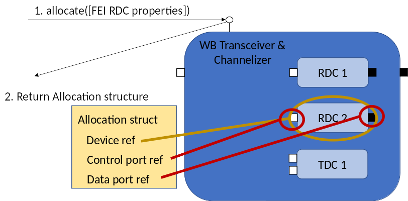

## Multi-Channel Frontend Devices

Multi-channel devices provide a single point where different, often independent, RF devices operate.
However, these devices are bound in the same enclosure, making them inter-linked in arbitrary ways.
To further complicate the issue, independent channels may not be fixed in number, as in the case of a channelizer implemented on FPGA.

For these reasons, a static definition (e.g.: XML-defined) for these devices is not the most appropriate implementation.
To address this workflow, the concepts of child devices was developed for FEI 3.0.
In child devices, a single device process space is used to associate multiple device class definitions.
The definition of these child devices with respect to the parent device is shown in the following diagram:


As seen in the image above, the parent device is defined by its software package, software component, and properties definition XML (SPD, SCD, and PRF, respetively).
Each child device is defined as software component and property definition files only, since they share the software package definition with the parent device.
The generated code is a single project that contains all device classes.

Devices are deployed programmatically at runtime.
Device deployment is through the addChild method in the Device base class.
The addChild method is invoked on whichever device is the logical parent of the child device.

For example, suppose that XML is defined for device "my_parent", "child_class_a", and "child_class_b".
After the code is generated, the directory is populated with the following file tree:

```
my_parent
|   my_parent.spd.xml
|   my_parent.scd.xml
|   my_parent.prf.xml
|   child_class_a.scd.xml
|   child_class_a.prf.xml
|   child_class_b.scd.xml
|   child_class_b.prf.xml
|   reconf
|   configure.ac
|   Makefile.am
|
|---cpp
|   |   my_parent.cpp
|   |   my_parent.h
|   |   my_parent_base.cpp
|   |   my_parent_base.h
|   |
|   |---child_class_a
|   |   |   child_class_a.cpp
|   |   |   child_class_a.h
|   |   |   child_class_a_base.cpp
|   |   |   child_class_a_base.h
|   |
|   |---child_class_b
|   |   |   child_class_b.cpp
|   |   |   child_class_b.h
|   |   |   child_class_b_base.cpp
|   |   |   child_class_b_base.h
```

If a device instance tree were to model the underlying hardware where my_parent has an instance of child_class_a and an instance of child_class_b as children, with the instance of child_class_a with an additional instance of child_class_b as children, the code in my_parent.cpp would be as follows:

``` c++
#include "child_class_a/child_class_a.h"
#include "child_class_b/child_class_b.h"
```

``` c++
// this device instantiation code was added to the constructor, but it does not need to be added there
void my_parent_i::constructor()
{
    std::string child_class_a_name("child_class_a");
    std::string child_class_b_name("child_class_b");

    child_class_a_i* first_layer_a = this->addChild<child_class_a_i>(child_class_a_name);
    child_class_a_i* first_layer_b = this->addChild<child_class_a_i>(child_class_b_name);

    child_class_a_i* second_layer_b = first_layer_a->addChild<child_class_a_i>(child_class_b_name);
}
```

Note that the instantiation is to a local variable that will exit scope at the end of the function.
Even though the pointer exits scope, the device is still present as a child.
To retrieve the deployed child devices, member _dynamicComponents, a vector of Device_impl pointers contains all devices that the parent currently holds, can be used.
Below is an example of using _dynamicComponents:

``` c++
    for (unsigned int i=0; i<_dynamicComponents.size(); i++) {
        child_class_a_i* base_dev = dynamic_cast<child_class_a_i*>(_dynamicComponents[i]);
        std::cout<<"  "<<_dynamicComponents[i]->_identifier;
        if (base_dev == NULL) {
            std::cout<<" is not of type child_class_a_i";
        } else {
            std::cout<<" is of type child_class_a_i";
        }
        std::cout<<std::endl;
    }
```

The vector _dynamicComponents is public, so a particular device's children can be inspected by other classes.
Thread-safe changes to _dynamicComponents are managed through the DynamicComponent class's _dynamicComponentDeploymentLock member.

The relationship between child and parent devices can be tracked through the Aggregate device interface, where the parent device has a list of child devices and each child lists the parent:
```python
    from ossie.utils import redhawk
    dom=redhawk.attach()
    DeviceA = None
    for dev in dom.devMgrs[0].devs:
        if dev.name == 'DeviceA':
            DeviceA = dev
            break

    DeviceB = DeviceA.devices[0]

    DeviceC = DeviceB.devices[0]
    DeviceD = DeviceB.devices[1]

    up_DeviceB = DeviceC.compositeDevice
    up_DeviceA = up_DeviceB.compositeDevice
```

The relationship between parent device A, child device B, itself with child device C and child device D is shown graphically:


## Parent/Child FEI Devices
---

In the context of FEI, it is possible to programmatically create device proxies that model the underlying hardware.
For example, in the case where the configuration of the underlying RF hardware is not static and an API exists to scan the hardware, the following CONOP is enabled by the addChild API:


As seen in the example above, the underlying hardware is a transceiver with two receive channels and one transmit channel.
Each devices is quasi-independent, sharing some common device control functionality, but each subsystem operating in a semi-independent fashion.

## Allocations with feedback
---

Devices' capacity management interface has been extended to provide better support to sophisticated multi-device allocations.
Single allocations can now be made through the allocate() call.
The allocate method is defined as follows:

```idl
    struct Allocation {
        CF::Device device_ref;      // device that satisfied the allocation (the allocation could have been delegated)
        Object data_port;           // data port (provides for TX, uses for RX)
        Object control_port;        // control port - object ref
        CF::Properties allocated;   // what allocation values the device met
        string alloc_id;            // unique identifier (used to deallocate)
    };
    typedef sequence <Allocation> Allocations;

    Allocations allocate(in CF::Properties capacities);
```

The allocate method takes a sequence of properties as its argument and returns a sequence of Allocation structures.
Each Allocation structure instance returned contains a pointer to the device that satisfied the allocation request (which may or may not be the device the allocate call was made on), a reference to the data port (if any) that relates to the allocation, a reference to the control port (if any) that relates to the allocation, the allocation values actually made on the device, and a unique allocation id.

The reason why the Allocation structure returns the actual allocations is because they may different slightly from the request.
For example, in the case of a tuner, while a request may be for 12 kHz of bandwidth, if the device can only be configured to 12.5 kHz bandwidth, then the returned allocation value is 12.5 kHz.

Even though a sequence of Allocation instances is returned, all the structures returned in a single allocate() call relate to the same allocation.
For example, if a coherent receive array had is requested, the return value would contain an Allocation structure instance for each receive tuner that makes up the receive array.
The unique allocation id, generated by the device responding to the allocation, populates every Allocation structure returned on the allocate() call.
The receiver array example is described in more detail in the next section.

The data port reference is the data port associated with the allocation.
For example, in the case of a DDC allocation, the data port corresponds to the tuner's output port.
Conversely, in the case of a DUC allocation, the data port corresponds to the digital up-converter's data input port (to be transmitted over the air).
In the case in which the allocation does not have a corresponding data transport, as in the case of generic processing resources, the data port reference is nil.

Much like the data port, the control port reference is for the control port associated with the allocation.
In the case of FEI, this could be a DigitalTuner port or a ScanningDigitalTuner port.
In cases where the allocation does not correspond to a controllable resource, the control port reference is nil.

Deallocation is based on the allocation id returned in the Allocation structures returned by the allocate() call
The deallocate call is as follows:

```idl
    void deallocate(in allocation_id);
```

All devices that are associated with the given allocation id are deallocated.
For example, if a phased array is allocated with n tuners and the deallocate() call is made on the parent devices, then all associated DDCs are deallocated.
In the case of such collective allocations, the deallocate call can be made against one of the single DDC devices; in such a case, that specific DDC is deallocated, but all others remain allocated.

Continuing with the example transceiver in the previous section, a single allocation made to the parent device can return the allocation of a single DDC, as shown below:



The return value from the allocation to the parent device is the child device's reference as well as its output data port and input control port.

## Controlling Coherent Receivers (arrays) with Frontend Interfaces
---

When ingesting data from coherent tuners, allocations must be coordinated between multiple independent tuners; each of these tuners is associated with a different RF receiver and a different antenna. While each of these tuners is ostensibly independent, they must all be tuned to the same frequency over the same bandwith, with data generated coherently (in lock-step) between the different tuners.

The mechanism for supporting the process is a composite (aggregate) device. In this case, each tuner (DDC for FEI) is a child of a wideband receiver (RX or RX_DIGITIZER for FEI), and each wideband receiver is the child of the array device proxy (RX_ARRAY for FEI).

The wideband receiver would be RX_DIGITIZER if it contains a wideband data output and RX if it does not.
An RX_DIGITIZER is a combination of RX and DDC, so a single tuner attached to a parent RX (or RX_DIGITIZER) is a DDC.
Multiple receivers (RX or RX_DIGITIZER) can be combined into a coherent set, where the set is controlled by RX_ARRAY.

This device parent hierarchy is shown below:


The programmatic deployment of these devices uses the addChild method built into each of these devices. For example, a single RX_ARRAY (rx_array_i) creating two instances of RX_DIGITIZER (rx_digitizer_i), each with 2 DDC (ddc_i) could be coded as follows in rx_array.cpp:

``` c++
#include "rx_digitizer/rx_digitizer.h"
#include "ddc/ddc.h"
```

``` c++
// this device instantiation code was added to the constructor, but it does not need to be added there
void rx_array_i::constructor()
{
    std::string rx_digitizer_name("rx_digitizer");
    std::string ddc_name("ddc");

    rx_digitizer_i* rx_digitizer_1 = this->addChild<rx_digitizer_i>(rx_digitizer_name);
    ddc_i* ddc_1_1 = rx_digitizer_1->addChild<ddc_i>(ddc_name);
    ddc_i* ddc_1_2 = rx_digitizer_1->addChild<ddc_i>(ddc_name);

    rx_digitizer_i* rx_digitizer_2 = this->addChild<rx_digitizer_i>(rx_digitizer_name);
    ddc_i* ddc_2_1 = rx_digitizer_2->addChild<ddc_i>(ddc_name);
    ddc_i* ddc_2_2 = rx_digitizer_2->addChild<ddc_i>(ddc_name);
}
```

As shown above, the device hierarchy is defined programmatically in the parent device, in this case the RX_ARRAY device.
This relationship can be shown programmatically from the Python sandbox.
For example, assuming that the Python session is attached to a domain with a deployment of the devices and node included in this project, the following code can be used to retrieve the array, the rx_digitizer receivers, and the single-channel ddc tuners:

```python
    from ossie.utils import redhawk
    dom=redhawk.attach()
    agg_dev = None
    for dev in dom.devMgrs[0].devs:
        if dev.name == 'rx_array':
            agg_dev = dev
            break
    rx_d_1 = agg_dev.devices[0]
    rx_d_2 = agg_dev.devices[1]

    ddc_in_rx_d_1 = []
    for dev in rx_d_1.devices:
        ddc_in_rx_d_1.append(dev)

    ddc_in_rx_d_2 = []
    for dev in rx_d_2.devices:
        ddc_in_rx_d_2.append(dev)
```

The parent device can be retrieved from any one child device.

```python
    for dev in dom.devMgrs[0].devs:
        if 'ddc' in dev.label:
            ddc_rx = dev
            break
    rx_d = ddc_rx.compositeDevice
    rx_array = rx_d.compositeDevice
```

For the array to function correctly, each wideband receiver must be connected to a different antenna; this antenna can be modeled with the GenericAntenna device, and its RFInfo port can be used to pass the rf_flow_id for that specific antenna element.
To propagate the rf_flow_id, the rx_digitier's output RFInfo port needs to be connected to each ddc's input RFInfo port; this functionality is not created by the code generators because it is CONOP-specific and must be implemented by the developer in the port's callback function.
Note that this connection does not have to be defined in XML; instead it can be implemented programmatically when the devices are instantiated.

## Allocating a set of coherent channels

Unfortunately, some of the data structures needed to allocate an array are currently not available in the IDE; the allocations must be made through a programmatic interface like the Python sandbox.

To allocate an array, the allocation property "FRONTEND::coherent_feeds" of type string sequence was created. The number of string elements in the sequence determines how many tuners (from different wideband feeds) need to be allocated for this request. If the value in each of these strings is not an empty string, then that specific set of rf_flow_id values must be matched. If each string is empty, then any of the wideband feeds can satisfy the request. Note that at most 1 tuner per wideband feed can be allocated in each request.

To allocate 2 tuners with 1kHz of bandwidth for rf_flow_id "aperture_1" and "aperture_2", perform the following allocation:
```python
    from ossie.utils import redhawk
    import frontend
    from ossie.cf import CF
    from omniORB import any as _any

    dom=redhawk.attach()
    agg_dev = None
    for dev in dom.devMgrs[0].devs:
        if dev.name == 'rx_array':
            agg_dev = dev
            break

    alloc_tuner_1=frontend.createTunerAllocation(tuner_type='DDC',allocation_id='alloc_id_1', bandwidth=1000.0,returnDict=False)
    coherent_request=CF.DataType(id='FRONTEND::coherent_feeds', value=_any.to_any(['aperture_1', 'aperture_2']))
    allocation_response = agg_dev.allocate([alloc_tuner_1, coherent_request])
```

Deallocation requires the same properties:
```python
    agg_dev.deallocate(allocation_response[0].alloc_id)
```

To allocate 2 tuners with 1kHz of bandwidth for any rf_flow_id, perform the following allocation:
```python
    alloc_tuner_1=frontend.createTunerAllocation(tuner_type='RX_DIGITIZER',allocation_id='alloc_id_1', bandwidth=1000.0,returnDict=False)
    coherent_request_any_feed=CF.DataType(id='FRONTEND::coherent_feeds', value=_any.to_any(['', '']))
    allocation_response = agg_dev.allocate([alloc_tuner_1, coherent_request_any_feed])
```

To allocate scanning tuners, all is needed is to include the scanner allocation request. For example, assuming that a scanning functionality is needed where the scanner is expected to change frequencies above 10kHz, use the following allocation:

```python
    alloc_scanner=frontend.createScannerAllocation(min_freq=10000.0,returnDict=False) alloc_tuner_1=frontend.createTunerAllocation(tuner_type='RX_DIGITIZER',allocation_id='alloc_id_1', bandwidth=1000.0,returnDict=False)
    coherent_request_any_feed=CF.DataType(id='FRONTEND::coherent_feeds', value=_any.to_any(['', '']))
    allocation_response = agg_dev.allocate([alloc_tuner_1, coherent_request_any_feed])
```

If scanning functionality is needed, then each device's scan plan needs to be set independently, where the scan strategy is set for each device separately and the scan start time is set to some arbitrary time in the future.

## Connecting to the Device's Output

A benefit of this approach is that each tuner is single-channel, that means that there is not multi-out functionality controlled by a connectionTable. The only data outputs are out of each single-channel tuner, and each of these tuners can support only a single stream. This means that no special name convention is needed for the connection id

```python
    alloc_tuner_1=frontend.createTunerAllocation(tuner_type='RX_DIGITIZER',allocation_id='alloc_id_1', bandwidth=1000.0,returnDict=False)
    coherent_request_any_feed=CF.DataType(id='FRONTEND::coherent_feeds', value=_any.to_any(['', '']))
    allocation_response = agg_dev.allocate([alloc_tuner_1, coherent_request_any_feed])

    # assume that component "process_narrowband" exists and has a bulkio input port that matches the ddc output
    snk_1 = sb.launch('process_narrowband')
    snk_2 = sb.launch('process_narrowband')

    allocation_response[0].data_port.connectPort(snk_1.getPort('dataShort_in'), 'connection_id_1')
    allocation_response[1].data_port.connectPort(snk_2.getPort('dataShort_in'), 'connection_id_1')
```

## Transmit CONOP


## Developing Devices

The described rx_array, rx_digitizer, and ddc devices are custom devices that are not currently supported through REDHAWK's standard code generators in the completed array configuration.
This functionality can be added to future versions if this pattern is deemed useful by the users.
