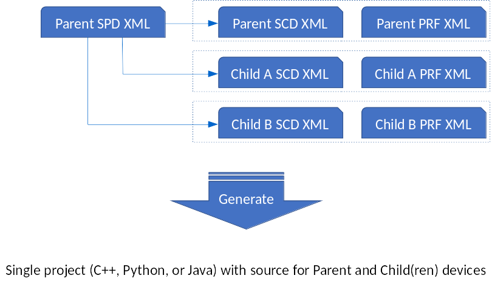
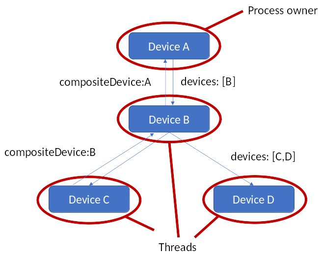
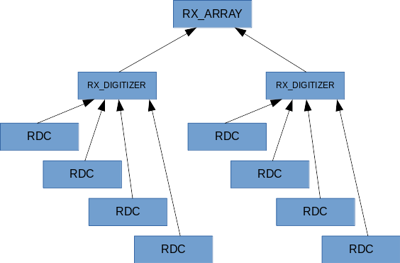
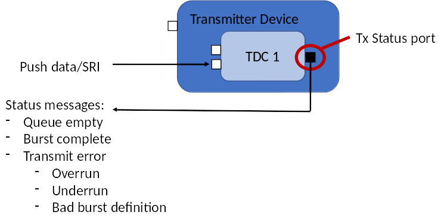

## Multi-Channel Frontend Devices

Multi-channel devices provide a single point where different, often independent, RF devices operate.
However, these devices are bound in the same enclosure, making them inter-linked in arbitrary ways.
To further complicate the issue, independent channels may not be fixed in number, as in the case of a channelizer implemented on FPGA.

For these reasons, a static definition (e.g.: XML-defined) for these devices is not the most appropriate implementation.
To address this workflow, the concepts of child devices was developed for FEI 3.0.
In child devices, a single device process space is used to associate multiple device class definitions.
The definition of these child devices with respect to the parent device is shown in the following diagram:



As seen in the image above, the parent device is defined by its software package, software component, and properties definition XML (SPD, SCD, and PRF, respetively).
Each child device is defined as software component and property definition files only, since they share the software package definition with the parent device.
The generated code is a single project that contains all device classes.

Devices are deployed programmatically at runtime.
Device deployment is through the addChild method in the Device base class.
The addChild method is invoked on whichever device is the logical parent of the child device.

For example, suppose that XML is defined for device "my_parent", "child_class_a", and "child_class_b".
After the code is generated, the directory is populated with the following file tree:

```
my_parent
|   my_parent.spd.xml
|   my_parent.scd.xml
|   my_parent.prf.xml
|   child_class_a.scd.xml
|   child_class_a.prf.xml
|   child_class_b.scd.xml
|   child_class_b.prf.xml
|   reconf
|   configure.ac
|   Makefile.am
|
|---cpp
|   |   my_parent.cpp
|   |   my_parent.h
|   |   my_parent_base.cpp
|   |   my_parent_base.h
|   |
|   |---child_class_a
|   |   |   child_class_a.cpp
|   |   |   child_class_a.h
|   |   |   child_class_a_base.cpp
|   |   |   child_class_a_base.h
|   |
|   |---child_class_b
|   |   |   child_class_b.cpp
|   |   |   child_class_b.h
|   |   |   child_class_b_base.cpp
|   |   |   child_class_b_base.h
```

If a device instance tree were to model the underlying hardware where my_parent has an instance of child_class_a and an instance of child_class_b as children, with the instance of child_class_a with an additional instance of child_class_b as children, the code in my_parent.cpp would be as follows:

``` c++
#include "child_class_a/child_class_a.h"
#include "child_class_b/child_class_b.h"
```

``` c++
// this device instantiation code was added to the constructor, but it does not need to be added there
void my_parent_i::constructor()
{
    std::string child_class_a_name("child_class_a");
    std::string child_class_b_name("child_class_b");

    child_class_a_i* first_layer_a = this->addChild<child_class_a_i>(child_class_a_name);
    child_class_a_i* first_layer_b = this->addChild<child_class_a_i>(child_class_b_name);

    child_class_a_i* second_layer_b = first_layer_a->addChild<child_class_a_i>(child_class_b_name);
}
```

Note that the instantiation is to a local variable that will exit scope at the end of the function.
Even though the pointer exits scope, the device is still present as a child.
To retrieve the deployed child devices, member _dynamicComponents, a vector of Device_impl pointers contains all devices that the parent currently holds, can be used.
Below is an example of using _dynamicComponents:

``` c++
    for (unsigned int i=0; i<_dynamicComponents.size(); i++) {
        child_class_a_i* base_dev = dynamic_cast<child_class_a_i*>(_dynamicComponents[i]);
        std::cout<<"  "<<_dynamicComponents[i]->_identifier;
        if (base_dev == NULL) {
            std::cout<<" is not of type child_class_a_i";
        } else {
            std::cout<<" is of type child_class_a_i";
        }
        std::cout<<std::endl;
    }
```

The vector _dynamicComponents is public, so a particular device's children can be inspected by other classes.
Thread-safe changes to _dynamicComponents are managed through the DynamicComponent class's _dynamicComponentDeploymentLock member.

The relationship between child and parent devices can be tracked through the Aggregate device interface, where the parent device has a list of child devices and each child lists the parent:
```python
    from ossie.utils import redhawk
    dom=redhawk.attach()
    DeviceA = None
    for dev in dom.devMgrs[0].devs:
        if dev.name == 'DeviceA':
            DeviceA = dev
            break

    DeviceB = DeviceA.devices[0]

    DeviceC = DeviceB.devices[0]
    DeviceD = DeviceB.devices[1]

    up_DeviceB = DeviceC.compositeDevice
    up_DeviceA = up_DeviceB.compositeDevice
```

The relationship between parent device A, child device B, itself with child device C and child device D is shown graphically:



## Parent/Child FEI Devices
---

In the context of FEI, it is possible to programmatically create device proxies that model the underlying hardware.
For example, in the case where the configuration of the underlying RF hardware is not static and an API exists to scan the hardware, the following CONOP is enabled by the addChild API:


As seen in the example above, the underlying hardware is a transceiver with two receive channels and one transmit channel.
Each devices is quasi-independent, sharing some common device control functionality, but each subsystem operating in a semi-independent fashion.

## Allocations with feedback
---

Devices' capacity management interface has been extended to provide better support to sophisticated multi-device allocations.
Single allocations can now be made through the allocate() call.
The allocate method is defined as follows:

```idl
    struct Allocation {
        CF::Device device_ref;      // device that satisfied the allocation (the allocation could have been delegated)
        Object data_port;           // data port (provides for TX, uses for RX)
        Object control_port;        // control port - object ref
        CF::Properties allocated;   // what allocation values the device met
        string alloc_id;            // unique identifier (used to deallocate)
    };
    typedef sequence <Allocation> Allocations;

    Allocations allocate(in CF::Properties capacities);
```

The allocate method takes a sequence of properties as its argument and returns a sequence of Allocation structures.
Each Allocation structure instance returned contains a pointer to the device that satisfied the allocation request (which may or may not be the device the allocate call was made on), a reference to the data port (if any) that relates to the allocation, a reference to the control port (if any) that relates to the allocation, the allocation values actually made on the device, and a unique allocation id.

The reason why the Allocation structure returns the actual allocations is because they may different slightly from the request.
For example, in the case of a tuner, while a request may be for 12 kHz of bandwidth, if the device can only be configured to 12.5 kHz bandwidth, then the returned allocation value is 12.5 kHz.

Even though a sequence of Allocation instances is returned, all the structures returned in a single allocate() call relate to the same allocation.
For example, if a coherent receive array had is requested, the return value would contain an Allocation structure instance for each receive tuner that makes up the receive array.
The unique allocation id, generated by the device responding to the allocation, populates every Allocation structure returned on the allocate() call.
The receiver array example is described in more detail in the next section.

The data port reference is the data port associated with the allocation.
For example, in the case of a DDC allocation, the data port corresponds to the tuner's output port.
Conversely, in the case of a DUC allocation, the data port corresponds to the digital up-converter's data input port (to be transmitted over the air).
In the case in which the allocation does not have a corresponding data transport, as in the case of generic processing resources, the data port reference is nil.

Much like the data port, the control port reference is for the control port associated with the allocation.
In the case of FEI, this could be a DigitalTuner port or a ScanningDigitalTuner port.
In cases where the allocation does not correspond to a controllable resource, the control port reference is nil.

Deallocation is based on the allocation id returned in the Allocation structures returned by the allocate() call
The deallocate call is as follows:

```idl
    void deallocate(in allocation_id);
```

All devices that are associated with the given allocation id are deallocated.
For example, if a phased array is allocated with n tuners and the deallocate() call is made on the parent device, then all associated DDCs are deallocated.
In the case of such allocations where more than one device is allocated (such as in an array), the deallocate call can be made against one of the single DDC devices to deallocate just that one device and not the others in the initial allocation.

Continuing with the example transceiver in the previous section, a single allocation made to the parent device can return the allocation of a single DDC, as shown below:


The return value from the allocation to the parent device is the child device's reference as well as its output data port and input control port.

## Controlling Coherent Receivers (arrays) with Frontend Interfaces
---

When ingesting data from coherent tuners, allocations must be coordinated between multiple independent tuners; each of these tuners is associated with a different RF receiver and a different antenna. While each of these tuners is ostensibly independent, they must all be tuned to the same frequency over the same bandwith, with data generated coherently (in lock-step) between the different tuners.

The mechanism for supporting the process is a parent (aggregate) device for the array, child devices for each receiver, and the receivers each having child devices for each tuner. In this case, each tuner (DDC FEI device) is a child of a wideband receiver (RX or RX_DIGITIZER FEI device), and each wideband receiver is the child of the array device proxy (RX_ARRAY FEI device).

The wideband receiver is an RX_DIGITIZER if it contains a wideband data output and RX if it does not.
An RX_DIGITIZER is a combination of RX and DDC, so a single tuner attached to a parent RX (or RX_DIGITIZER) is a DDC.
Multiple receivers (RX or RX_DIGITIZER) can be combined into a coherent set, where the set is controlled by RX_ARRAY.

This device parent hierarchy is shown below:



The programmatic deployment of these devices uses the addChild method built into each of these devices. For example, a single RX_ARRAY (rx_array_i) creating two instances of RX_DIGITIZER (rx_digitizer_i), each with 2 DDC (ddc_i) could be coded as follows in rx_array.cpp:

``` c++
#include "rx_digitizer/rx_digitizer.h"
#include "ddc/ddc.h"
```

``` c++
// this device instantiation code was added to the constructor, but it does not need to be added there
void rx_array_i::constructor()
{
    std::string rx_digitizer_name("rx_digitizer");
    std::string ddc_name("ddc");

    rx_digitizer_i* rx_digitizer_1 = this->addChild<rx_digitizer_i>(rx_digitizer_name);
    ddc_i* ddc_1_1 = rx_digitizer_1->addChild<ddc_i>(ddc_name);
    ddc_i* ddc_1_2 = rx_digitizer_1->addChild<ddc_i>(ddc_name);

    rx_digitizer_i* rx_digitizer_2 = this->addChild<rx_digitizer_i>(rx_digitizer_name);
    ddc_i* ddc_2_1 = rx_digitizer_2->addChild<ddc_i>(ddc_name);
    ddc_i* ddc_2_2 = rx_digitizer_2->addChild<ddc_i>(ddc_name);
}
```

As shown above, the device hierarchy is defined programmatically in the parent device, in this case the RX_ARRAY device.
This relationship can be shown programmatically from the Python sandbox.
For example, assuming that the Python session is attached to a domain with a deployment of the devices and node included in this project, the following code can be used to retrieve the array, the rx_digitizer receivers, and the single-channel ddc tuners:

```python
    from ossie.utils import redhawk
    dom=redhawk.attach()
    agg_dev = None
    for dev in dom.devMgrs[0].devs:
        if dev.name == 'rx_array':
            agg_dev = dev
            break
    rx_d_1 = agg_dev.devices[0]
    rx_d_2 = agg_dev.devices[1]

    ddc_in_rx_d_1 = []
    for dev in rx_d_1.devices:
        ddc_in_rx_d_1.append(dev)

    ddc_in_rx_d_2 = []
    for dev in rx_d_2.devices:
        ddc_in_rx_d_2.append(dev)
```

The parent device can be retrieved from any one child device.

```python
    for dev in dom.devMgrs[0].devs:
        if 'ddc' in dev.label:
            ddc_rx = dev
            break
    rx_d = ddc_rx.compositeDevice
    rx_array = rx_d.compositeDevice
```

For the array to function correctly, each wideband receiver must be connected to a different antenna; this antenna can be modeled with the GenericAntenna device, and its RFInfo port can be used to pass the rf_flow_id for that specific antenna element.
To propagate the rf_flow_id, the rx_digitier's output RFInfo port needs to be connected to each ddc's input RFInfo port; this functionality is not created by the code generators because it is CONOP-specific and must be implemented by the developer in the port's callback function.
Note that this connection does not have to be defined in XML; instead it can be implemented programmatically when the devices are instantiated.

## Allocating a set of coherent channels

Unfortunately, some of the data structures needed to allocate an array are currently not available in the IDE; the allocations must be made through a programmatic interface like the Python sandbox.

To allocate an array, the allocation property "FRONTEND::coherent_feeds" of type string sequence was created. The number of string elements in the sequence determines how many tuners (from different wideband feeds) need to be allocated for this request. If the value in each of these strings is not an empty string, then that specific set of rf_flow_id values must be matched. If each string is empty, then any of the wideband feeds can satisfy the request. Note that at most 1 tuner per wideband feed can be allocated in each request.

To allocate 2 tuners with 1kHz of bandwidth for rf_flow_id "aperture_1" and "aperture_2", perform the following allocation:
```python
    from ossie.utils import redhawk
    import frontend
    from ossie.cf import CF
    from omniORB import any as _any

    dom=redhawk.attach()
    agg_dev = None
    for dev in dom.devMgrs[0].devs:
        if dev.name == 'rx_array':
            agg_dev = dev
            break

    alloc_tuner_1=frontend.createTunerAllocation(tuner_type='DDC',allocation_id='alloc_id_1', bandwidth=1000.0,returnDict=False)
    coherent_request=CF.DataType(id='FRONTEND::coherent_feeds', value=_any.to_any(['aperture_1', 'aperture_2']))
    allocation_response = agg_dev.allocate([alloc_tuner_1, coherent_request])
```

Deallocation requires the same properties:
```python
    agg_dev.deallocate(allocation_response[0].alloc_id)
```

To allocate 2 tuners with 1kHz of bandwidth for any rf_flow_id, perform the following allocation:
```python
    alloc_tuner_1=frontend.createTunerAllocation(tuner_type='DDC',allocation_id='alloc_id_1', bandwidth=1000.0,returnDict=False)
    coherent_request_any_feed=CF.DataType(id='FRONTEND::coherent_feeds', value=_any.to_any(['', '']))
    allocation_response = agg_dev.allocate([alloc_tuner_1, coherent_request_any_feed])
```

To allocate scanning tuners, all is needed is to include the scanner allocation request. For example, assuming that a scanning functionality is needed where the scanner is expected to change frequencies above 10kHz, use the following allocation:

```python
    alloc_scanner=frontend.createScannerAllocation(min_freq=10000.0,returnDict=False) alloc_tuner_1=frontend.createTunerAllocation(tuner_type='DDC',allocation_id='alloc_id_1', bandwidth=1000.0,returnDict=False)
    coherent_request_any_feed=CF.DataType(id='FRONTEND::coherent_feeds', value=_any.to_any(['', '']))
    allocation_response = agg_dev.allocate([alloc_tuner_1, coherent_request_any_feed])
```

If scanning functionality is needed, then each device's scan plan needs to be set independently, where the scan strategy is set for each device separately and the scan start time is set to some arbitrary time in the future.

## Connecting to the Device's Output

A benefit of this approach is that each tuner is single-channel, that means that there is not multi-out functionality controlled by a connectionTable. The only data outputs are out of each single-channel tuner, and each of these tuners can support only a single stream. This means that no special name convention is needed for the connection id

```python
    alloc_tuner_1=frontend.createTunerAllocation(tuner_type='DDC',allocation_id='alloc_id_1', bandwidth=1000.0,returnDict=False)
    coherent_request_any_feed=CF.DataType(id='FRONTEND::coherent_feeds', value=_any.to_any(['', '']))
    allocation_response = agg_dev.allocate([alloc_tuner_1, coherent_request_any_feed])

    # assume that component "process_narrowband" exists and has a bulkio input port that matches the ddc output
    snk_1 = sb.launch('process_narrowband')
    snk_2 = sb.launch('process_narrowband')

    allocation_response[0].data_port.connectPort(snk_1.getPort('dataShort_in'), 'connection_id_1')
    allocation_response[1].data_port.connectPort(snk_2.getPort('dataShort_in'), 'connection_id_1')
```

## Transmit CONOP

Transmit operations are performed through a digital up-converter (DUC) device.
The DUC device may or may not be the child of a TX device.
If a single transmit channel is supported, then the single DUC is connected to an implied TX device.
In the case where more than one DUC is attached to a single RF transmitter, then the multiple DUC devices are children of the TX device.

In the case where the device is simple, such as a single hard-wired DUC, then the entire process space can be the DUC device.
In cases where the underlying hardware is configurable, as in the case of devices like the USRP, then a host process would scan the underlying hardware and deploy the appropriate number of DUC devices.

Transmit allocations are made as a combination of two properties: FRONTEND::tuner_allocation and FRONTEND::transmitter_allocation.
The FRONTEND::tuner_allocation structure provides information regarding the center frequency, RF bandwidth, and/or sampling rate.
The FRONTEND::transmitter_allocation structure provides information regarding the expected agility of the tranmission:

| ID | name | type | description
| --- | --- | --- | ---
| FRONTEND::transmitter_allocation::min_freq | min_freq | double | In Hz. Requested lower edge of the transmit range (-1 for ignore)
| FRONTEND::transmitter_allocation::max_freq | max_freq | double | In Hz. Requested upper edge of the transmit range (-1 for ignore)
| FRONTEND::transmitter_allocation::control_limit | control_limit | double | In seconds. control_limit >= sample_rate/(max_settle_time+min_dwell_time) is met before the next retune (-1 for ignore)
| FRONTEND::transmitter_allocation::max_power | max_power | double | In Watts. max_power => transmitted power (-1 for ignore)

As seen above, the FRONTEND::transmitter_allocation structure provides parameters for the expected agility of the transmitter; namely the minimum and maximum frequency over which transmissions may occur, the minimum effective dwell time for transmission (defined as the settling time plus the transmission time), and the maximum expected power.
Each of these members may be set to "ignore" by passing a -1 as its value.

An example allocation of a transmitter is as follows:

```python
    alloc_tuner_1=frontend.createTunerAllocation(tuner_type='DUC',allocation_id='alloc_id_1', center_frequency=1e6,returnDict=False)
    alloc_duc_1=frontend.createTransmitAllocation(min_freq=900e3, max_freq=1.1e6, control_limit=0.1, max_power=-1,returnDict=False)
    allocation_response = agg_dev.allocate([alloc_tuner_1, alloc_duc_1])
```

A successful allocation returns a reference to the DUC device as well as its data port, in this case an input or "provides" port, and the control port.

Transmission queuing and execution is managed through BULK IO's timestamp.
Providing a timestamp of 0 or in the past results in immediate transmission.
Providing a timestamp in the future queues the packet for transmission when the current time matches the timestamp.
This packet transmission process is shown below:


```c++
    std::string stream_id = "testStream";
    unsigned int size_packet_1 = 1000;
    unsigned int size_packet_2 = 500;
    unsigned int size_packet_3 = 400;
    double t1 = 5;
    double t2 = t1+5;
    double t3 = t2+4;

    BULKIO::PrecisionUTCTime tstamp = bulkio::time::utils::now();
    double twsec = tstamp.twsec;

    bulkio::OutShortStream outputStream = dataShort_out->getStream(stream_id);
    if (!outputStream) {
        outputStream = dataShort_out->createStream(stream_id);
        outputStream.blocking(true);
    }
    redhawk::buffer<short> Packet1(size_packet_1);
    // data would be added to Packet1 here
    tstamp.twsec = twsec + t1;
    outputStream.write(Packet1, tstamp);

    redhawk::buffer<short> Packet2(size_packet_2);
    // data would be added to Packet2 here
    tstamp.twsec = twsec + t2;
    outputStream.write(Packet2, tstamp);

    redhawk::buffer<short> Packet3(size_packet_3);
    // data would be added to Packet3 here
    tstamp.twsec = twsec + t3;
    outputStream.write(Packet3, tstamp);
```
As shown above, the different packets are wqueued through the port's stream API, with the provided timestamp giving the transmitter transmission directions.
BULK IO is also used when transmissions are to be sent over different frequencies.
The re-tuning instructions are inserted as keyword CHAN_RF in SRI updates, as seen below:


```c++
    std::string stream_id = "testStream";
    unsigned int size_packet_1 = 1000;
    unsigned int size_packet_2 = 500;
    double t1 = 5;
    double t2 = t1+5;
    double f1 = 1e6;
    double f2 = 2e6;

    BULKIO::PrecisionUTCTime tstamp = bulkio::time::utils::now();
    double twsec = tstamp.twsec;

    bulkio::OutShortStream outputStream = dataShort_out->getStream(stream_id);
    if (!outputStream) {
        outputStream = dataShort_out->createStream(stream_id);
        outputStream.blocking(true);
    }

    redhawk::PropertyMap new_keywords;

    new_keywords["CHAN_RF"] = f1;
    outputStream.keywords(new_keywords);
    redhawk::buffer<short> Packet1(size_packet_1);
    // data would be added to Packet1 here
    tstamp.twsec = twsec + t1;
    outputStream.write(Packet1, tstamp);

    new_keywords["CHAN_RF"] = f2;
    outputStream.keywords(new_keywords);
    redhawk::buffer<short> Packet2(size_packet_2);
    // data would be added to Packet2 here
    tstamp.twsec = twsec + t2;
    outputStream.write(Packet2, tstamp);
```

Note that the stream id plays no role in the basic transmit API.
Stream id differentiation becomes important when different transmission priorities are mixed.
To provide a stream id a particular priority, add the keyword FRONTEND::PRIORITY with value of type short with the stream's priority to the SRI keywords.

```c++
    std::string stream_id = "testStream";
    unsigned int size_packet_1 = 1000;
    unsigned int size_packet_2 = 500;
    double t1 = 5;
    double t2 = t1+5;
    double f1 = 1e6;
    double f2 = 2e6;
    short priority = 3;

    BULKIO::PrecisionUTCTime tstamp = bulkio::time::utils::now();
    double twsec = tstamp.twsec;

    bulkio::OutShortStream outputStream = dataShort_out->getStream(stream_id);
    if (!outputStream) {
        outputStream = dataShort_out->createStream(stream_id);
        outputStream.blocking(true);
    }

    redhawk::PropertyMap new_keywords;

    new_keywords["CHAN_RF"] = f1;
    new_keywords["FRONTEND::PRIORITY"] = priority;
    outputStream.keywords(new_keywords);
    redhawk::buffer<short> Packet1(size_packet_1);
    // data would be added to Packet1 here
    tstamp.twsec = twsec + t1;
    outputStream.write(Packet1, tstamp);

    new_keywords["CHAN_RF"] = f2;
    // note that new_keywords still contains FRONTEND::PRIORITY
    outputStream.keywords(new_keywords);
    redhawk::buffer<short> Packet2(size_packet_2);
    // data would be added to Packet2 here
    tstamp.twsec = twsec + t2;
    outputStream.write(Packet2, tstamp);
```

When overlapping scheduled transmissions conflict, the transmission with the higher priority is transmitted.

### Continuous burst

To transmit multiple packets as a single continuous signal burst, setting the timestamp to immediately follow end of the last symbol can lead to undefined boundary conditions.


To remove the ambiguity of the transmitted construct, the timestamp in subsequent packet(s) can be set such that the separate packets are interpreted by the transmitter as a continuous transmitted signal.
Set the timestamp to invalid and both the whole (twsec) and fractional (tfsec) to 0, as shown below:

```c++
    std::string stream_id = "testStream";
    unsigned int size_packet_1 = 1000;
    unsigned int size_packet_2 = 500;

    BULKIO::PrecisionUTCTime tstamp = bulkio::time::utils::now();

    bulkio::OutShortStream outputStream = dataShort_out->getStream(stream_id);
    if (!outputStream) {
        outputStream = dataShort_out->createStream(stream_id);
        outputStream.blocking(true);
    }

    redhawk::buffer<short> Burst1(size_packet_1);
    // data would be added to Burst1 here
    tstamp.twsec = tstamp.twsec + 5;
    outputStream.write(Burst1, tstamp);

    redhawk::buffer<short> Burst2(size_packet_2);
    // data would be added to Burst2 here
    tstamp.tcstatus = BULKIO::TCS_INVALID;
    tstamp.tfsec = 0;
    tstamp.twsec = 0;
    outputStream.write(Burst2, tstamp);
```

### Feedback

Feedback from the device is sent through the DUC's status port, as seen in the following figure:



The DUC's status port is named "transmitDeviceStatus_out" and uses the TransmitDeviceStatus interface.
The DeviceStatus interfaces is as follows:

```idl
    module CF {
        enum DeviceStatusCodeType {
            DEV_OK,                             // device operating normally
            DEV_UNDERFLOW,                      // not enough data to fill the needed time
            DEV_OVERFLOW,                       // hardware cannot transmit the data at the rate requested
            DEV_INSUFFICIENT_SETTLING_TIME,     // time difference between end of last transmit and new transmit with a tune is insufficient
            DEV_MISSED_TRANSMIT_WINDOW,         // transmit could not begin at the requested time
            DEV_INVALID_TRANSMIT_TIME_OVERLAP,  // the timestamp for the last sample in the previous packet is after the timestamp for the first sample in the current packet
            DEV_INVALID_HARDWARE_STATE,         // hardware state is invalid (e.g.: configuration placed hardware in an invalid state)
            DEV_HARDWARE_FAILURE                // general hardware failure
        };

        // generic device status
        struct DeviceStatusType {
            string                      allocation_id;
            CF::UTCTime                 timestamp;
            CF::DeviceStatusCodeType    status;         // device status
            string                      message;        // status-specific message
            CF::Properties              props;          // status-specific properties
        };

        interface DeviceStatus {
            // triggers for status message: change in status
            void statusChanged(in DeviceStatusType status);
        };
    };

    module FRONTEND {
        struct TransmitStatusType {
            string                      stream_id;
            string                      allocation_id;
            CF::UTCTime                 timestamp;
            unsigned long long          total_samples;  // number of samples transmitted from this stream id; resets to 0 when >= max Ulonglong
            unsigned long long          total_packets;  // number of packets transmitted (pushPacket calls) from this stream id; resets to 0 when >= max Ulonglong
            boolean                     transmitting;   // true when currently transmitting, false when no queued data to transmit
            CF::DeviceStatusCodeType    status;         // device status
            double                      settling_time;  // this is the hardware's current re-tune settling time
            unsigned long               queued_packets; // number of packets that are yet to be transmitted (current queue size)
        };

        interface TransmitDeviceStatus : CF::DeviceStatus {
            // triggers for status message: change in status, change in transmitting, or queued_packets increases or becomes zero
            void transmitStatusChanged(in TransmitStatusType status);
        };
    };
```

Control of the transmitter, beyond that afforded by timestamps and keywords in BULK IO, is concerned with error recovery.
For example, in some CONOPs it may be required to have a well-defined strict schedule of transmitted packets, while in other CONOPs, it may be acceptable for some packets to be sent with loose timing or not at all.
The definition of the response to error states is control through the TransmitControl interface, which in turn inherits from the DigitalTuner interface:

```idl
    interface TransmitControl : DigitalTuner {
        struct TransmitParameters {
            string  stream_id;          // if empty string, then applies to all streams
            boolean ignore_timestamp;   // set to true for continuous data. Insufficient data will cause an DEV_UNDERFLOW error
            boolean ignore_error;       // set to true to ignore error states and just transmit
            double  tx_power;           // -1 for don't care
            double  max_timing_error;   // how much deviation (over/under) before DEV_MISSED_TRANSMIT_WINDOW is set as the error code; -1 for don't care
            // time for the packet transmission is the bulk io timestamp, unless ignore_timestamp is true; then data is sent as soon as it is available
            // center frequency for the packet transmission is CHAN_RF keyword in SRI
            // duration of the packet is the length of the packet * the sampling period (in SRI)
        };

        // reset allocation(s):
        //    - remove error codes
        //    - empty the transmit queue
        //    - reset total_samples count
        //    - reset total_packets count
        // if stream_id == "", the reset applies to all streams
        void reset(in string stream_id)
            raises (FRONTEND::FrontendException);

        void setTransmitParameters(in TransmitParameters transmit_parameters)
            raises (FRONTEND::FrontendException, FRONTEND::BadParameterException);

        TransmitParameters getTransmitParameters()
            raises (FRONTEND::FrontendException);
    };
```

Note that the allocation id is not an argument for these function calls.
Since each DUC is associated with a single allocation, a call over the DUC's TransmitControl interface is implicitly associated with a single allocation.
Interactions with parent devices means that calls over the TransmitControl interface applies to all child devices that support the TransmitControl interface.

The reset method of the TransmitControl interface allows a device to exit the error state, empty its transmit queue, and reset all transmission counters.
Set ignore_error to true in the TransmitParameters for the device's best-effort attempt to transmit data irrespective of error state.
If ignore_error is set to true and an error condition occurs, such as an DEV_OVERFLOW, the device will notify the error state but continue to transmit.

### Error States

There are multiple errors associated with the FEI transmit API.

#### DEV_UNDERFLOW

The transmitter sets its transmission rate based on the xdelta (sampling period) for the stream.
DEV_UNDERFLOW occurs when ignore_timestamp is set to true and there is not enough queued data to maintain the requested transmit rate.

#### DEV_OVERFLOW

The given xdelta (sampling period) for the stream is less than the maximum rate supported by the transmitter.
If ignore_error is true, data is transmitted at the maximum rate supported by the hardware.

#### DEV_INSUFFICIENT_SETTLING_TIME

The time difference between packets where a re-tune occurred is insufficient for the transmitter to settle to the new frequency before the provided timestamp expires.
This error cannot occur if ignore_timestamp is set to true.

#### DEV_MISSED_TRANSMIT_WINDOW

The data packet was received too late to honor the timestamp.
This error cannot occur if ignore_timestamp is true.

#### DEV_INVALID_TRANSMIT_TIME_OVERLAP

The difference in timestamp between consecutive packets is less than the length of the first packet.
This error cannot occur if ignore_timestamp is true.

#### DEV_INVALID_HARDWARE_STATE

The hardware has been incorrectly configured.
The hardware cannot function as configured and the device is no longer transmitting irrespective of the state of the ignore_error flag.

#### DEV_HARDWARE_FAILURE

A catastrophic hardware failure has been detected.
The hardware can no longer function and the device is no longer transmitting irrespective of the state of the ignore_error flag.

## Conflicting transmit stream scenarios

The following sections describe several scenarios where the timestamp and priority between different streams conflicts and the corresponding behavior.

### Transmission with Multiple Priorities and Not Ignore Errors

Transmission with mixed priorities will lead to mixed error conditions.
Suppose the transmitter is currently supporting transmissions for "Stream A" with no set priority.
The transmissions for "Stream A" are queued and are in the process of tranmission.
A new stream, "Stream B", is received by the DUC; "Stream B" has FRONTEND::PRIORITY = 5.
"Stream B" has transmissions that overlap with "Stream A" packets.
Assuming that stream_id = "", ignore_error = false, and ignore_timestamp = false in TransmitParameters, in such instance the following occurs:

- "Stream B" packets are transmitted
- "Stream A" queued packets are flushed
- A TransmitStatusType status change is generated:
 - stream_id = "Stream A"
 - status = DEV_INVALID_TRANSMIT_TIME_OVERLAP
- All subsequent received "Stream A" packets are immediately flushed
- "Stream B" packets proceed as planned and as they arrive
- If new "Stream C" with no priority set arrives, this stream operates normally until it overlaps with "Stream B"

### Transmission with Multiple Priorities and Ignore Errors

Transmission with mixed priorities will lead to mixed error conditions.
Suppose the transmitter is currently supporting transmissions for "Stream A" with no set priority.
The transmissions for "Stream A" are queued and are in the process of tranmission.
A new stream, "Stream B", is received by the DUC; "Stream B" has FRONTEND::PRIORITY = 5.
"Stream B" has transmissions that overlap with "Stream A" packets.
Assuming that stream_id = "", ignore_error = true, and ignore_timestamp = false in TransmitParameters, in such instance the following occurs:

- "Stream B" packets are transmitted
- "Stream A" that overlap with "Stream B" packets are flushed
- A TransmitStatusType status change is generated:
 - stream_id = "Stream A"
 - status = DEV_INVALID_TRANSMIT_TIME_OVERLAP
- All subsequent received "Stream A" packets are flushed if they overlap with "Stream B" packets
- "Stream B" packets proceed as planned and as they arrive
- If new "Stream C" with no priority set arrives, this stream operates normally until it overlaps with "Stream B" or "Stream A"

### Transmission with Multiple Priorities and Ignore Timestamp (both values of Ignore Errors)

Transmission with mixed priorities will lead to mixed error conditions.
Suppose the transmitter is currently supporting transmissions for "Stream A" with no set priority.
The transmissions for "Stream A" are queued and are in the process of tranmission.
A new stream, "Stream B", is received by the DUC; "Stream B" has FRONTEND::PRIORITY = 5.
"Stream B" has transmissions that overlap with "Stream A" packets.
Assuming that stream_id = "", ignore_error = false, and ignore_timestamp = true in TransmitParameters, in such instance the following occurs:

- "Stream B" packets are transmitted
- "Stream A" queued packets are ignored until "Stream B" queue is empty
- "Stream B" packets proceed as planned and as they arrive; the "Stream A" packet queue is ignored until the "Stream B" packet queue is empty
- If new "Stream C" with no priority set arrives, this stream queue is ignored until "Stream B" queue is empty
- "Stream C" amd "Stream A" queues are handled on a first-come-first-served basis

Because no error condition was triggered, the value of ignore_error has no effect on this scenario

### Transmission with Equal (or no) Priorities and Not Ignore Errors

Transmission with equal priorities or priorities not set will lead to consistent error conditions.
Suppose the transmitter is currently supporting transmissions for "Stream A" with no set priority.
The transmissions for "Stream A" are queued and are in the process of tranmission.
A new stream, "Stream B", is received by the DUC also with no set priority.
"Stream B" has transmissions that overlap with "Stream A" packets.
Assuming that stream_id = "", ignore_error = false, and ignore_timestamp = false in TransmitParameters, in such instance the following occurs:

- "Stream A" queued packets are flushed
- "Stream B" queued packets are flushed
- TransmitStatusType status change is generated:
 - stream_id = "Stream A"
 - status = DEV_INVALID_TRANSMIT_TIME_OVERLAP
- TransmitStatusType status change is generated:
 - stream_id = "Stream B"
 - status = DEV_INVALID_TRANSMIT_TIME_OVERLAP
- All subsequent received "Stream A" or "Stream B" packets are immediately flushed
- If new "Stream C" arrives, this stream is treated normally, since it will not overlap with the flushed packets

### Transmission with Equal (or no) Priorities and Ignore Errors

Transmission with equal priorities or priorities not set will lead to consistent error conditions.
Suppose the transmitter is currently supporting transmissions for "Stream A" with no set priority.
The transmissions for "Stream A" are queued and are in the process of tranmission.
A new stream, "Stream B", is received by the DUC also with no set priority.
"Stream B" has transmissions that overlap with "Stream A" packets,.
Assuming that stream_id = "", ignore_error = true, and ignore_timestamp = false in TransmitParameters, in such instance the following occurs:

- "Stream B" packets whose timestamp arrive while "Stream A" is transmitting are flushed
- "Stream A" packets whose timestamp arrive while "Stream B" is transmitting are flushed
- TransmitStatusType status change is generated:
 - stream_id = "Stream A"
 - status = DEV_INVALID_TRANSMIT_TIME_OVERLAP
- TransmitStatusType status change is generated:
 - stream_id = "Stream B"
 - status = DEV_INVALID_TRANSMIT_TIME_OVERLAP
- Subsequent "Stream A" and "Stream B" packets are handled on a first-come-first-served basis
- If new "Stream C" arrives also with no priority, this stream is treated equally as "Stream A" and "Stream B"

### Error Recovery

To remove the error state from any one stream, reset() must be invoked on the DUC's control port.
After reset() is invoked, any stream in an error state (e.g.: "Stream A" in the above examples), has the following event issued:
- TransmitStatusType status change is generated:
 - stream_id = "Stream A"
 - status = DEV_OK

