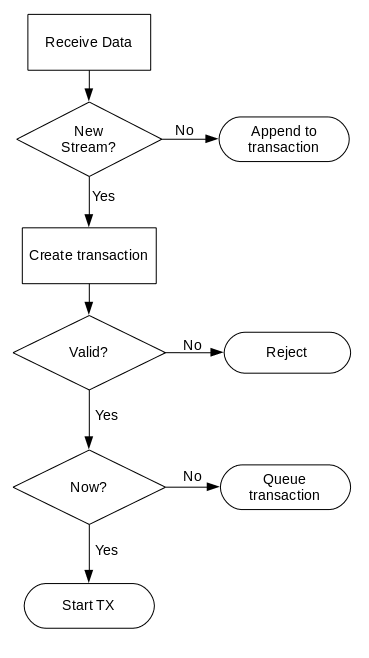

# Transaction

A transaction is an atomic unit of transmission.
It comprises one contiguous set of samples to be transmitted, at one tuner configuration (center frequency, bandwidth, etc.), starting at time t0.
A transaction must be associated with a tuner via an allocation ID.

If more than one tuner configuration is required to realize a particular transmission effect, multiple transactions must be used.

Transactions may be queued in advance to ensure synchronicity and data continuity.

A transaction is represented by a single BulkIO stream.

## Flowchart



## Identifier

A transaction is uniquely identified within the tuner's queue by the BulkIO stream `streamID`.

It follows that there may not be more than one transaction in the queue with the same `streamID` at any point in time; therefore, the device shall reject a duplicate `streamID`.

It is legal to reuse the same `streamID` at a later date, once the prior transaction has completed.

## Start

A new transaction is created when the device receives a new StreamSRI and the first data packet for that stream.
```
stream.open()
stream.write(d0, t0)
```

The data packet timestamp, `t0`, indicates when the transaction is scheduled to start.
If `t0` is 0 or the current time, the transaction should start immediately if possible.
If `t0` is in the future, the transaction is queued until that time.
If `t0` is in the past ???

## Device Control

If the transaction requires tuner configuration, the StreamSRI must contain a `FRONTEND::tuner_allocation` keyword.
The value of the keyword is a `FRONTEND::tuner_allocation` structure with the new configuration.
The device rejects the transaction if the new configuration is not possible.
The `FRONTEND::tuner_allocation` keyword must not be modified for successive pushes; the device may ignore the changes or cancel the transaction.

The device must account for its settling time when applying a new tuner configuration.
That is, if a device requires a period of `tS` before its clock can be considered coherent, for a transaction with a start time of `t0`, the configuration should be applied at time `t0 - tS`.

## Data Queueing

Successive data packets represent contiguous samples and are appended to the transaction.
```
stream.write(d1, t1)
...
stream.write(dN, tN)
```

Until an end-of-stream flag is received, the transaction is considered "open".

Timestamps may be zero, indicating that no further timing information is included.
The interpretation of non-zero timestamps is up to the device (?).

### Underflow

If a transaction is currently active and the device has transmitted all of its queued samples, the device enters an underflow condition if more than a sample period worth of time passes without further data.
Upon entering an underflow condition, the device produces a notification using the device status mechanism (TBD).

### Overflow

If the device cannot queue incoming data for a transaction (such as might occur in a BulkIO queue flush), the device enters an overflow condition.
Upon entering an overflow condition, the device produces a notification using the device status mechanism (TBD).

## End

Closing the stream (i.e., sending a packet with `EOS` set) indicates to the device that no further data will be received for the transaction ("end of burst"):
```
stream.close()
```

When the device finishes transmitting the last data set, the transaction is complete, and the device will not enter an underflow condition.

## Execution Modes

Transactions may be executed in two modes: automatic and manual.
The mode determines the level of control with regard to tuner configuration and tranmit times.

### Automatic Mode

Automatic mode is intended for the simple case, where a `TX` tuner is allocated and data is sent to the device.
This mode is the default when there is no `FRONTEND::tuner_allocation` keyword in the StreamSRI, and allows signal data created by a generic flow to be transmitted without additional management.
It is not necessary to have an intermediate component that manages the transmission.

In automatic mode, a BulkIO stream is matched to an allocation via the connection ID (see: provide-side connections).

As there may not be a transmit manager component, the BulkIO timestamps are ignored and the tuner transmits the data as soon as possible.

### Manual Mode

Manual mode uses a (presumably CONOP-specific) component to mediate transactions, providing data-synchronous tuner control and transaction scheduling.
This mode is enabled when the StreamSRI contains an `FRONTEND::tuner_allocation` keyword.
The keyword must contain an `allocation_id` field which supersedes the connection ID for matching a BulkIO stream to an allocation.

## Tuner Queue

Each tuner in the device maintains its own queue of transactions.
The queue is visible externally via the QueuedDevice IDL.

When a transaction is created, the device validates the transaction, including the start time and the tuner configuration.
If the transaction is not valid, it is rejected and an error notification is produced (TBD, see device status).
If the transaction is valid, it is added to the tuner's queue.

The tuner queue is a list of transactions sorted in order of start time, ascending.

A transaction remains in the queue until it is completed or cancelled.

### Validation

It is left to the device to determine the specific criteria under which a transaction will be accepted.
In the simple case, transactions can not overlap in time, including any required settling time.
However, more sophisticated devices may be able to do some form of multiplexing.

### Active Transactions

A queued transaction becomes "active" when the device begins to act upon it (e.g., starts transmitting).
This must be no later than the transaction's start time, `t0`.
If the transaction includes tuner control, this may occur prior to `t0` in order to account for settling time.

_**Question**:  Does this warrant status notification?_

### Underflow

Underflow occurs when there is an active transaction and the device's buffer becomes empty.
This may occur between the REDHAWK device layer and the device driver, or between the device driver and the hardware.
REDHAWK does not define how to manage the latter "internal" underflow, as it is device-specific.
Device implementers may choose to provide further control; however, this limits portability.

If an application is sensitive to exact timing and/or data continuity, it may choose to have the transaction cancelled.
However, an application that is more tolerant of error may prefer to keep transmitting.

An optional field, `underflow_policy`, will be added to the `FRONTEND::tuner_allocation` struct.
The type is `short` and it has two enumerated values:

| Value | Label    |
| ----- | -------- |
| 0     | CONTINUE |
| 1     | CANCEL   |

An `underflow_policy` of `CONTINUE` indicates that the device should continue transmitting when new data becomes available for the transaction.
If timestamps are being used to indicate further timing control, they should be interpreted as though the device were not in an underflow state.

An `underflow_policy` of `CANCEL` immediately cancels the transaction when the device enters an underflow state.
Further data received for that transaction is discarded.

The `underflow_policy` value may be set in the StreamSRI `FRONTEND::tuner_allocation` keyword, or as part of the `allocateCapacity()` call.
If `underflow_policy` is not specified, it is left to the device to determine its default policy.
REDHAWK recommends a default policy of `CONTINUE`.

### Overflow

In a transmit scenario, overflow should only be possible when the BulkIO queue flushes.
If the queue has flushed, there is data being sent to the port much faster than it is being read.
This would probably indicate a system managment problem, as the device is being overtasked.

For consistency, an optional field `overflow_policy` will be added to the `FRONTEND::tuner_allocation` struct.
It has the same type and meaning as `underflow_policy`.

### Completion

An active transaction is complete when all of the data for the transaction has been transmitted.

_**Question**:  Does this warrant status notification?_

### Priority

Transactions may be enqueued with a priority value that determines the relative importance of transactions.
Higher priorty transactions may preempt lower priority transactions.

### Cancellation

When a transaction is cancelled, it is removed from the tuner's queue and will not be acted upon.
If the transaction is still open, all further data from the stream will be discarded upon receipt.

Cancellation may be requested for a transaction in the tuner's queue, including active transactions.
The device is free to reject a cancellation request if it cannot be completed, such as when the transaction's sample data has already been transferred to a device's FPGA fabric but not transmitted yet.
Transactions are also cancelled when they are preempted by a higher priority transaction.

When a transaction is cancelled, the device reports the cancellation via the device status mechanism (TBD).
